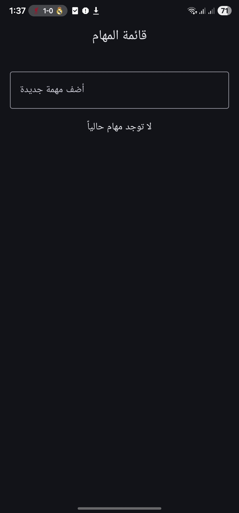
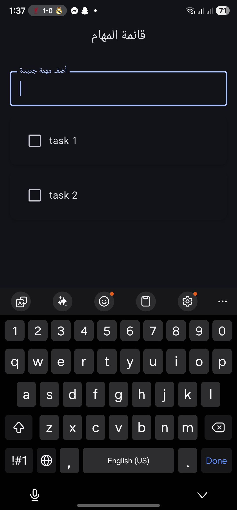
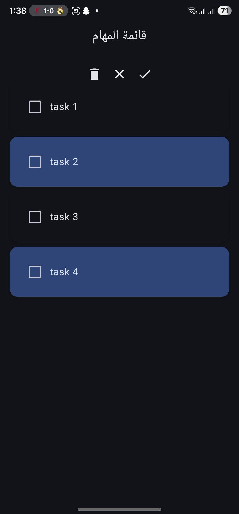

# 📝 To-Do App

An elegant **Android To-Do List Application** built with **Kotlin** and **Jetpack Compose**, following the **Clean Architecture** pattern for scalability and testability.

---


## 📱 Screenshots

| Home | Add Task | Delete Multiple |
|------|-----------|----------------|
|  |  |  |

## ✨ Features

- ✅ Add, edit, and delete tasks
- 📅 Mark tasks as completed
- 🗑️ Bulk delete completed tasks
- 💾 Persistent data storage using Room Database
- 🧠 Clean Architecture + MVVM Pattern
- ⚙️ Dependency Injection ready structure
- 🎨 Built 100% with Jetpack Compose

---

## 🧱 Tech Stack

| Layer | Technology Used |
|-------|------------------|
| UI | Jetpack Compose |
| State Management | ViewModel + MutableState |
| Domain | UseCases + Clean Architecture |
| Data | Room Database + Repository Pattern |
| Language | Kotlin |
| Tools | Android Studio, Gradle |

---

## 🧩 Architecture Overview

```text
UI (Jetpack Compose)
    ↓
ViewModel
    ↓
UseCases (Domain Layer)
    ↓
Repository (Data Layer)
    ↓
Room Database (DAO, Entity)
```


This structure ensures **separation of concerns**, testability, and maintainability.

---

## 🧠 What I Learned

- Applying **Clean Architecture** in Android projects  
- Building UI entirely with **Jetpack Compose**  
- Managing app state efficiently using **ViewModel**  
- Working with **Room Database** and DAO  
- Writing modular, scalable Kotlin code  

---

## 🚀 How to Run the Project

1. Clone the repository:
   ```bash
   git clone https://github.com/mo7amedtaym/Todo-app.git
2. Open the project in Android Studio

3. Run the app on an emulator or physical device


## 🧑‍💻 Author

**Mohamed Tayee**  
Android Developer | Kotlin Enthusiast | Clean Architecture Advocate  

📧 **Email:** [taym6116@gmail.com](mailto:taym6116@gmail.com)  
💼 **LinkedIn:** [linkedin.com/in/mohamed-atef-tayee](https://www.linkedin.com/in/mohamed-atef-tayee/)  
🐙 **GitHub:** [@mo7amedtaym](https://github.com/mo7amedtaym)
